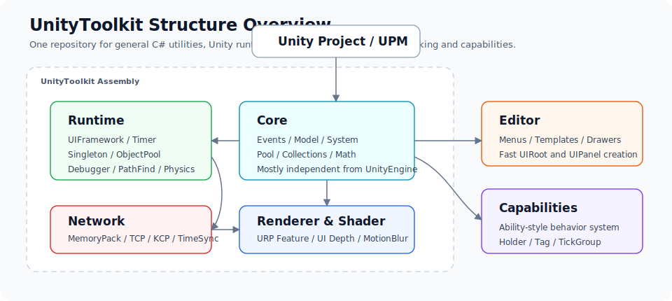
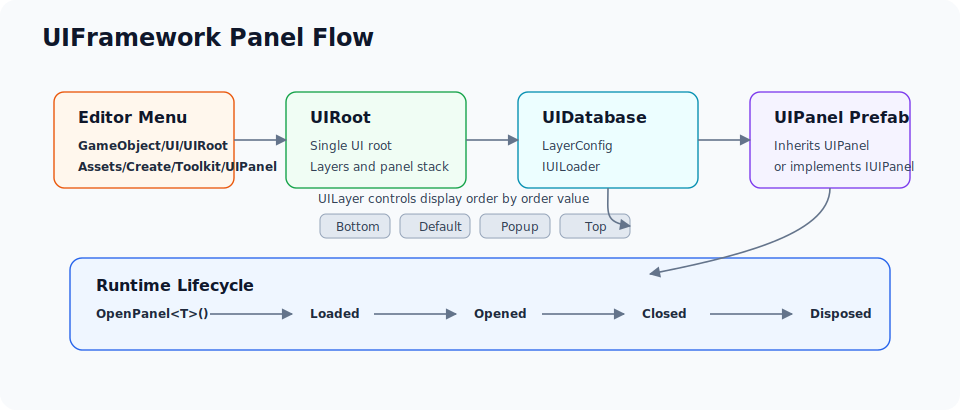
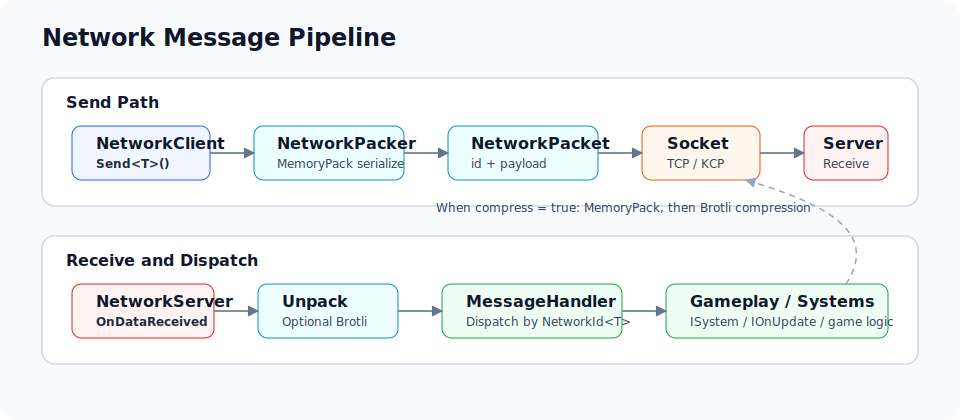
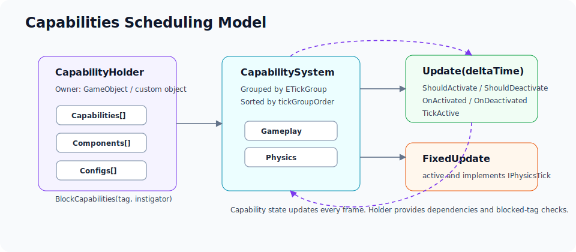

# UnityToolkit

[Simplified Chinese](README.md)

UnityToolkit is a Unity game-development toolkit repository. It contains both general-purpose C# utilities that can be moved into non-Unity projects and Unity-specific runtime/editor tools.

The repository is organized as a Unity Package Manager package. The package name is `com.nicoier.unitytoolkit`. `package.json` declares `2021.3` as the minimum Unity version, while the older README baseline was `2021.3.15+`.

<p align="center">
  
</p>

## Feature Overview

- General C# Core: event systems, commands, data binding, ModelCenter, SystemLocator, IOCContainer, object pools, concurrent pools, caches, data structures, math helpers and utility APIs.
- Unity Runtime: UIFramework, LoopScrollRect, object pool management, MonoSingleton, Timer, main-thread dispatching, pathfinding, physics/raycast helpers, runtime Debugger, scene/screen systems and reusable UI components.
- URP and Shader tools: UI depth occlusion, Stencil Buffer, MotionBlur, Dither, RendererFeature helpers and Shader/HLSL assets.
- Editor tools: fast UIRoot/UIPanel creation, LoopScrollRect menus, ProgressBar/PolygonUI menus, URP shader templates, layer helpers and mesh vertex normalization.
- Network: MemoryPack-based message packing, built-in Telepathy(TCP) and KCP sockets, optional Brotli compression, message handlers, client/server tick systems, UDP time sync and local broadcast helpers.
- Capabilities: a lightweight Gameplay Ability style system with TickGroup scheduling, activation/deactivation conditions, blocked tags, component/config lookup and Unity ScriptableObject/MonoBehaviour extensions.

## Installation

### Unity Package Manager

Open `Window/Package Manager` in Unity, choose `Add package from git URL...`, then enter:

```text
https://github.com/NicoIer/UnityToolkit.git
```

You can also add it directly to `Packages/manifest.json`:

```json
{
  "dependencies": {
    "com.nicoier.unitytoolkit": "https://github.com/NicoIer/UnityToolkit.git"
  }
}
```

### Release Package

If a `.unitypackage` is available in Releases, download it and import it into your Unity project.

### Dependencies

- `Runtime/UnityToolkit.asmdef` references TextMeshPro and URP assemblies. Install the corresponding Unity packages when using Runtime/UI/Renderer features.
- The Network module depends on `MemoryPack`. If your project does not use networking, you can remove the `Core/Network` directories or add the MemoryPack dependency.
- Odin Inspector integration is enabled only when `ODIN_INSPECTOR` / `ODIN_INSPECTOR_3` is defined. It is optional.
- If your game code uses asmdef files, reference `UnityToolkit` explicitly. Reference `Capabilities` as well when using the capability system.

## Directory Layout

| Path | Contents |
| --- | --- |
| `Core/` | General-purpose C# utilities that do not depend on UnityEngine, including events, models, systems, pools, collections, algorithms and network core code. |
| `Runtime/` | Unity runtime tools, including UI, object pools, singletons, Timer, Debugger, Renderer, Physics and PathFind. |
| `Editor/` | Unity Editor menus, asset creators, Inspector/Drawer helpers and development utilities. |
| `Capabilities/` | Standalone capability-system assembly with capability, component, config and holder abstractions. |
| `Runtime/Shader/` | URP, ShaderGraph and HLSL runtime assets. |
| `docs/images/` | SVG diagrams used by README files. |
| `Tool/` | Repository maintenance scripts. |

## Assemblies

| Assembly | Source | Description |
| --- | --- | --- |
| `UnityToolkit` | `Runtime/UnityToolkit.asmdef` | Main runtime assembly. `Core`, `Core/Network` and `Runtime/Renderer` are included through asmref files. |
| `UnityToolkit.Editor` | `Editor/UnityToolkit.Editor.asmdef` | Editor-only utility assembly, referencing `UnityToolkit`. |
| `Capabilities` | `Capabilities/Capabilities.asmdef` | Capability-system assembly, referencing `UnityToolkit`. |

## Core

`Core` is the most general C# part of the repository. Much of it can be reused in non-Unity projects.

Common entry points:

- `StaticEventSystem` / `TypeEventSystem`: type-based event systems. Listeners return an `ICommand` that can be executed to unsubscribe.
- `BindableProperty<T>` / `BindData<T>`: simple data binding and listener helpers.
- `Model<T>` / `ModelCenter`: data-model registration with event triggering.
- `SystemLocator`: registers, retrieves and disposes `ISystem` instances by type, with `IOnInit` / `IOnUpdate` support.
- `ObjectPool<T>` / `ConcurrentPool<T>` / `QueuePool<T>`: general and concurrent object pools.
- `PriorityQueue`, `FibonacciHeap`, `CircularBuffer`, `LURCache`, `Octree`, `KDTree`, `QuadTree`: common data structures.
- `ToolkitMath`, `AnimationCurve`, `TypeId`, `EntityIdGenerator`, `DeepCopyUtil`, `SystemUtil`: math, type, ID and system helpers.

Event-system example:

```csharp
using UnityToolkit;

public readonly struct PlayerDeadEvent
{
    public readonly int playerId;

    public PlayerDeadEvent(int playerId)
    {
        this.playerId = playerId;
    }
}

public sealed class BattlePresenter
{
    private ICommand _unlisten;

    public void Bind()
    {
        _unlisten = TypeEventSystem.Global.Listen<PlayerDeadEvent>(OnPlayerDead);
    }

    public void Unbind()
    {
        _unlisten.Execute();
    }

    private void OnPlayerDead(in PlayerDeadEvent e)
    {
        ToolkitLog.Info($"Player dead: {e.playerId}");
    }
}

TypeEventSystem.Global.Invoke(new PlayerDeadEvent(1001));
```

## UIFramework

UIFramework is built around `UIRoot`, `UIDatabase`, `IUILoader`, `UIPanel`, `UILayer` and a set of reusable UI components. It handles:

<p align="center">
  
</p>

- Maintaining a single `UIRoot` in the scene.
- Creating UI layers from `UIDatabase.LayerConfig`.
- Loading UIPanel prefabs synchronously, by callback or by `Task`.
- Managing panel opening, closing, caching, disposal and sorting.
- Providing components such as `ProgressBar`, `ProgressText`, `HealthBar`, `PolygonUI` and `NonDrawGraphic`.
- Integrating a LoopScrollRect implementation modified from qiankanglai/LoopScrollRect.

Quick start:

1. In the Hierarchy, run `GameObject/UI/UIRoot` to create a `UIRoot`.
2. If `Assets/UIDatabase.asset` does not exist, the tool creates a default database automatically.
3. In the Project view, select a target folder and run `Assets/Create/Toolkit/UIPanel` to create a panel prefab.
4. Create a script that inherits `UIPanel`, attach it to the prefab, and make sure the prefab can be loaded by `UIDatabase.Loader`.

```csharp
using UnityToolkit;

public sealed class MainMenuPanel : UIPanel
{
    public override void OnOpened()
    {
        base.OnOpened();
        ToolkitLog.Info("Main menu opened.");
    }
}

UIRoot.Singleton.OpenPanel<MainMenuPanel>();
UIRoot.Singleton.ClosePanel<MainMenuPanel>();
UIRoot.Singleton.CloseAll();
UIRoot.Singleton.Dispose<MainMenuPanel>();
```

The default `UIDatabase` loader uses `Resources.Load<GameObject>(typeof(T).Name)`. For Addressables or a custom asset system, implement `IUILoader` and assign it to:

```csharp
UIRoot.Singleton.UIDatabase.Loader = new MyUILoader();
```

LoopScrollRect notes:

- Menu entries: `GameObject/UI/Loop Horizontal Scroll Rect`, `GameObject/UI/Loop Vertical Scroll Rect`.
- Each item must have a `LayoutElement` with correct Preferred Width/Height values, otherwise layout issues may occur.

## Runtime Tools

- `MonoSingleton<T>`: scene lookup, auto-creation, `DontDestroyOnLoad` and PlayMode-only singleton strategies.
- `GameObjectPoolManager` / `EasyGameObjectPool` / `StackPool<T>`: GameObject and stack-style object pools. `IPoolObject` can hook into `OnGet` / `OnRelease`.
- `Timer`: delayed, looping, pausable, resumable and cancellable timers, with optional MonoBehaviour lifetime binding.
- `UnityMainThreadDispatcher`: dispatches work from background threads to the Unity main thread.
- `PathFindSystem`: grid-cost path queries with obstacle nodes and cached path trees by start point.
- `CharacterController2D`, `Trigger2DEventEmitter`, `Trigger3DEventEmitter`, `Physics3DHelper`, `RayCaster`: character-controller and physics helpers.
- `SerializableDictionary<TKey,TValue>`: Unity-serializable Dictionary.
- `SceneSystem`, `ScreenRotationSystem`, `PlayerLoopHelper`: scene, screen-rotation and PlayerLoop extensions.
- `DebuggerComponent`: runtime debugger with Console, system info, screen/graphics/input info, Profiler, memory and reference-pool windows.

Timer example:

```csharp
using UnityToolkit;

Timer.Register(
    duration: 1.5f,
    onComplete: () => ToolkitLog.Info("Timer completed."),
    isLooped: false,
    useRealTime: false);

this.AttachTimer(3f, () => ToolkitLog.Info("Owner is still alive."));
```

## Renderer and Shader

The Renderer directory provides URP-focused rendering helpers:

- `UIDepthOccluder` + `UIDepthOccluderFeature`: writes UI rects/meshes into depth so UI can occlude 3D objects.
- `StencilBufferRenderFeature`: Stencil RT helper for pre-Unity-6 URP pipelines.
- `DitherEffectRendererFeature`: Dither blit for Unity 6 RenderGraph.
- `MotionBlurActivator`: enables or disables a MotionBlur RendererFeature by camera.
- `RPMgr`, `ScriptableRendererExtension`, `VolumeExtensions`: URP Renderer/Volume helpers.
- `Runtime/Shader`: includes `UIDepthOccluder.shader`, `StencilOnly.shader`, `StencilBuffer.shader`, `MotionBlur`, `DitherPass` and `UnityToolkit.hlsl`.

Related Editor menus:

- `Assets/Create/Shader/URP/Unlit Shader`
- `Assets/Create/Shader/URP/FullScreen Shader`
- `Assets/Normalize Mesh Vertices to [0,1]`

## Network

The Network module is intended for small networked games or networking prototypes. Its core is under `Core/Network`. It depends on MemoryPack and provides:

<p align="center">
  
</p>

- `NetworkClient` / `NetworkServer`: client and server main loops.
- `IClientSocket` / `IServerSocket`: transport-layer abstractions.
- `TelepathyClientSocket` / `TelepathyServerSocket`: TCP transport.
- `KcpClientSocket` / `KcpServerSocket`: KCP transport.
- `NetworkClientMessageHandler` / `NetworkServerMessageHandler`: dispatch by `INetworkMessage` type.
- `NetworkPacker`: MemoryPack serialization with Brotli compression support.
- `NetworkTimeClient` / `NetworkTimeServer`: UDP time sync with RTT and server-time estimation.
- `LocalNetwork`: local-network broadcast/receive helper.

Minimal message example:

```csharp
using MemoryPack;
using Network;
using Network.Client;
using Network.Server;

[MemoryPackable]
public partial struct PingMessage : INetworkMessage
{
    public int tick;
}

var server = new NetworkServer(new TelepathyServerSocket(7777), compress: false);
server.AddMsgHandler<PingMessage>((in int connectionId, in PingMessage message) =>
{
    server.Send(connectionId, message, noDelay: true);
});
_ = server.Run(autoTick: true);

var client = new NetworkClient(new TelepathyClientSocket(), compress: false);
client.AddMsgHandler<PingMessage>((in PingMessage message) =>
{
    UnityToolkit.ToolkitLog.Info($"Pong: {message.tick}");
});
_ = client.Run(new Uri("tcp4://127.0.0.1:7777"), autoTick: true);
client.Send(new PingMessage { tick = 1 }, noDelay: true);
```

## Capabilities

`Capabilities` is a lightweight capability system for splitting character behavior into ability units that can activate, deactivate and tick in ordered groups.

<p align="center">
  
</p>

Core concepts:

- `ICapability` / `CapabilityBase<TTag, TOwner>`: the capability itself, defining `ShouldActivate`, `ShouldDeactivate`, `OnActivated`, `OnDeactivated` and `TickActive`.
- `CapabilitySystem`: schedules capabilities by `ETickGroup` and `tickGroupOrder`.
- `CapabilityHolderBase<TTag, TOwner>`: stores capabilities, components, configs and blocked-tag state.
- `MonoBehaviorCapabilityHolder<TTag>`: Unity `GameObject` oriented holder.
- `CapabilityAsset`, `ComponentAsset`, `ConfigAsset`: ScriptableObject-based dependency composition.
- `IPhysicsTick`, `IAnimationMove`: extension points for physics ticking and animation movement.

This module is still experimental and is best wrapped for your specific project.

## Editor Menu Reference

- `GameObject/UI/UIRoot`
- `Assets/Create/Toolkit/UIPanel`
- `GameObject/UI/UnityToolkit/ProgressBar`
- `GameObject/UI/UnityToolkit/PolygonUI`
- `GameObject/UI/Loop Horizontal Scroll Rect`
- `GameObject/UI/Loop Vertical Scroll Rect`
- `Assets/Create/Shader/URP/Unlit Shader`
- `Assets/Create/Shader/URP/FullScreen Shader`
- `Assets/Normalize Mesh Vertices to [0,1]`

## Third-party and License

This repository uses the MIT License. Some code or ideas come from open-source projects. See `THIRD PARTY NOTICES.md` and the README/LICENSE files in subdirectories for details:

- Mirror Networking
- kcp2k
- Telepathy
- KDTree
- LoopScrollRect
- UnityMainThreadDispatcher
- GameFramework Debugger

## Project Status

UnityToolkit is a continuously accumulated toolkit. It covers a wide range of modules, but documentation and examples are still being improved. Import modules as needed, and prefer reading the matching source directories and README files before production use.
