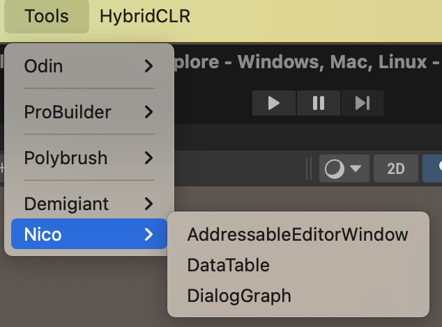
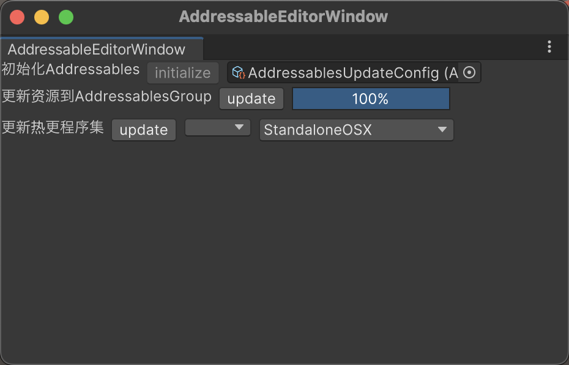
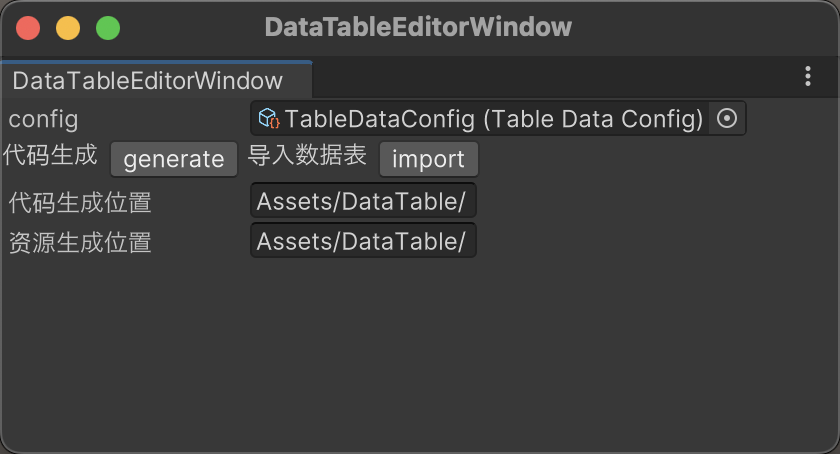
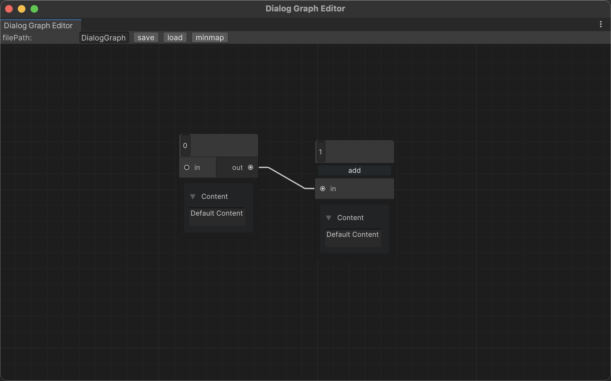

# Unity Toolkits :sob:

`Unity's development tools` 开发中积累的Unity开发工具包，提供一些游戏开发中经常会用到的内容，避免重复造轮子，为了隔离，功能间使用程序集定义进行了划分。目前文档还没有很完善，持续补全中:briefcase:

Unity版本>=2021.3.15

## 目录

## Modules :cry:

| 模块名            | 内容                                                         |
| ----------------- | ------------------------------------------------------------ |
| Core核心模块      | 数据结构算法                                                 |
| Toolkits 引擎模块 | 单独为Unity引擎提供的工具模块，常用工具(事件系统，定时器，单例....) |
| UFramework        | UI管理工具                                                   |
| Network           | 基于protobuf和开源kcp的网络同步框架                          |
|                   |                                                              |
|                   |                                                              |
|                   |                                                              |
|                   |                                                              |
|                   |                                                              |

## Editor Tool :laughing:

| 名称           | 内容                                                         | 使用方法                                  |
| -------------- | ------------------------------------------------------------ | ----------------------------------------- |
| 对话节点编辑器 | 参考ShaderGraph制作的对话节点编辑器，数据保存成So方便运行时加载 | 菜单栏Nico/Tools/DialogGraph              |
| 热更工具       | 基于Hybrid CLR和addressables制作的热更工具，点个按钮就能一键更新 | 菜单栏Nico/Tools/AddressablesEditorWindow |
| Excel导表工具  | 用Excel表格进行代码生成和转换SO的工具                        | 菜单栏Nico/Tools/DataTable                |

## 热更工具

## 导表工具

## 对话编辑器

