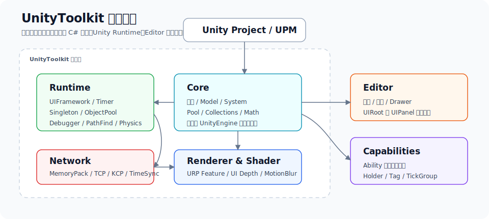
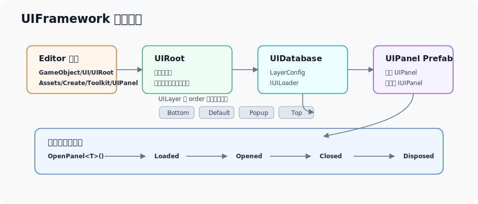
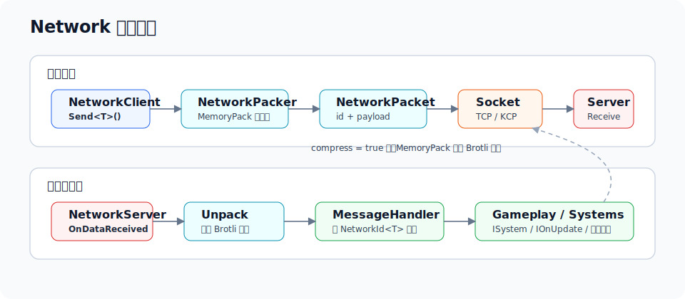
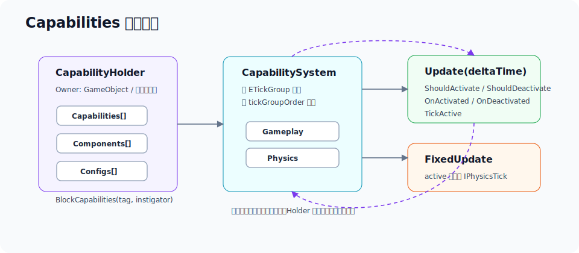

# UnityToolkit

[English](README-En.md)

UnityToolkit 是一个面向 Unity 游戏开发的工具集合仓库，同时包含可以迁移到普通 C# 项目的通用工具和依赖 UnityEngine 的运行时、编辑器工具。

这个仓库以 UPM 包的形式组织，包名为 `com.nicoier.unitytoolkit`。当前最低 Unity 版本按 `package.json` 标记为 `2021.3`，旧 README 中的使用基线为 `2021.3.15+`。

<p align="center">
  
</p>

## 特性概览

- 通用 C# Core：事件系统、命令、数据绑定、ModelCenter、SystemLocator、IOCContainer、对象池、并发池、缓存、数据结构、数学/工具方法等。
- Unity Runtime：UIFramework、LoopScrollRect、对象池管理、MonoSingleton、Timer、主线程调度、寻路、物理/射线辅助、运行时 Debugger、场景/屏幕系统、常用 UI 组件。
- URP/Shader 工具：UI 深度遮挡、Stencil Buffer、MotionBlur、Dither、RendererFeature 辅助和 Shader/HLSL 资源。
- Editor 工具：UIRoot/UIPanel 快速创建、LoopScrollRect 菜单、ProgressBar/PolygonUI 菜单、URP Shader 模板、Layer 辅助、Mesh 顶点归一化等。
- Network：基于 MemoryPack 的消息打包，内置 Telepathy(TCP) 与 KCP socket，支持可选 Brotli 压缩、消息处理器、客户端/服务端 Tick 系统、UDP 对时和本地广播工具。
- Capabilities：轻量 Gameplay Ability 风格能力系统，支持 TickGroup、激活/停用条件、阻塞 Tag、组件/配置查询和 Unity ScriptableObject/MonoBehaviour 扩展。

## 安装

### 通过 Unity Package Manager

在 Unity 中打开 `Window/Package Manager`，选择 `Add package from git URL...`，输入：

```text
https://github.com/NicoIer/UnityToolkit.git
```

也可以直接写入项目的 `Packages/manifest.json`：

```json
{
  "dependencies": {
    "com.nicoier.unitytoolkit": "https://github.com/NicoIer/UnityToolkit.git"
  }
}
```

### 通过 Release 包

如果 Releases 中提供 `.unitypackage`，也可以下载后直接导入 Unity 项目。

### 依赖说明

- `Runtime/UnityToolkit.asmdef` 引用了 TextMeshPro 和 URP 相关程序集，使用 Runtime/UI/Renderer 功能时需要项目已安装对应 Unity 包。
- Network 模块依赖 `MemoryPack`。如果项目不使用网络模块，可以移除 `Core/Network` 相关目录，或补齐 MemoryPack 依赖。
- Odin Inspector 只在定义了 `ODIN_INSPECTOR` / `ODIN_INSPECTOR_3` 时启用相关 Inspector 展示，不是必需依赖。
- 如果业务代码使用 asmdef，需要显式引用 `UnityToolkit`；使用能力系统时还需要引用 `Capabilities`。

## 目录结构

| 路径 | 内容 |
| --- | --- |
| `Core/` | 不依赖 UnityEngine 的通用 C# 工具，包含事件、模型、系统、对象池、集合、算法和网络核心。 |
| `Runtime/` | Unity 运行时工具，包含 UI、对象池、单例、Timer、Debugger、Renderer、Physics、PathFind 等。 |
| `Editor/` | Unity Editor 菜单、资源创建器、Inspector/Drawer 和开发辅助工具。 |
| `Capabilities/` | 独立的能力系统程序集，提供能力、组件、配置和 Holder 抽象。 |
| `Runtime/Shader/` | URP/ShaderGraph/HLSL 相关运行时资源。 |
| `docs/images/` | README 使用的 SVG 说明图。 |
| `Tool/` | 仓库维护脚本。 |

## 程序集

| 程序集 | 来源 | 说明 |
| --- | --- | --- |
| `UnityToolkit` | `Runtime/UnityToolkit.asmdef` | 主运行时程序集。`Core`、`Core/Network`、`Runtime/Renderer` 通过 asmref 加入该程序集。 |
| `UnityToolkit.Editor` | `Editor/UnityToolkit.Editor.asmdef` | Editor-only 工具程序集，引用 `UnityToolkit`。 |
| `Capabilities` | `Capabilities/Capabilities.asmdef` | 能力系统程序集，引用 `UnityToolkit`。 |

## Core

`Core` 是仓库中最接近普通 C# 工具库的部分，很多代码可以在非 Unity 项目中复用。

常用入口：

- `StaticEventSystem` / `TypeEventSystem`：基于类型的事件系统，注册后返回 `ICommand` 用于取消监听。
- `BindableProperty<T>` / `BindData<T>`：简单数据绑定与监听。
- `Model<T>` / `ModelCenter`：带事件触发的数据模型注册中心。
- `SystemLocator`：按类型注册、获取和释放 `ISystem`，支持 `IOnInit` / `IOnUpdate`。
- `ObjectPool<T>` / `ConcurrentPool<T>` / `QueuePool<T>`：通用对象池与并发对象池。
- `PriorityQueue`、`FibonacciHeap`、`CircularBuffer`、`LURCache`、`Octree`、`KDTree`、`QuadTree`：常用数据结构。
- `ToolkitMath`、`AnimationCurve`、`TypeId`、`EntityIdGenerator`、`DeepCopyUtil`、`SystemUtil`：数学、类型、ID 和系统工具。

事件系统示例：

```csharp
using UnityToolkit;

public readonly struct PlayerDeadEvent
{
    public readonly int playerId;

    public PlayerDeadEvent(int playerId)
    {
        this.playerId = playerId;
    }
}

public sealed class BattlePresenter
{
    private ICommand _unlisten;

    public void Bind()
    {
        _unlisten = TypeEventSystem.Global.Listen<PlayerDeadEvent>(OnPlayerDead);
    }

    public void Unbind()
    {
        _unlisten.Execute();
    }

    private void OnPlayerDead(in PlayerDeadEvent e)
    {
        ToolkitLog.Info($"Player dead: {e.playerId}");
    }
}

TypeEventSystem.Global.Invoke(new PlayerDeadEvent(1001));
```

## UIFramework

UIFramework 由 `UIRoot`、`UIDatabase`、`IUILoader`、`UIPanel`、`UILayer` 和一组 UI 组件组成。它负责：

<p align="center">
  
</p>

- 在场景中维护唯一的 `UIRoot`。
- 按 `UIDatabase.LayerConfig` 生成 UI 层级。
- 同步、回调或 `Task` 异步加载 UIPanel prefab。
- 管理打开、关闭、缓存、销毁和排序。
- 提供 `ProgressBar`、`ProgressText`、`HealthBar`、`PolygonUI`、`NonDrawGraphic` 等组件。
- 集成基于 qiankanglai/LoopScrollRect 修改的循环滚动列表。

快速使用：

1. 在 Hierarchy 中执行 `GameObject/UI/UIRoot` 创建 `UIRoot`。
2. 如果项目中没有 `Assets/UIDatabase.asset`，工具会自动创建一个默认数据库。
3. 在 Project 面板选择目标目录，执行 `Assets/Create/Toolkit/UIPanel` 创建面板 prefab。
4. 创建脚本继承 `UIPanel`，挂到对应 prefab 上，并确保 prefab 能被 `UIDatabase.Loader` 加载。

```csharp
using UnityToolkit;

public sealed class MainMenuPanel : UIPanel
{
    public override void OnOpened()
    {
        base.OnOpened();
        ToolkitLog.Info("Main menu opened.");
    }
}

UIRoot.Singleton.OpenPanel<MainMenuPanel>();
UIRoot.Singleton.ClosePanel<MainMenuPanel>();
UIRoot.Singleton.CloseAll();
UIRoot.Singleton.Dispose<MainMenuPanel>();
```

默认 `UIDatabase` 使用 `Resources.Load<GameObject>(typeof(T).Name)` 加载面板。需要 Addressables 或自定义资源系统时，实现 `IUILoader` 并赋值给：

```csharp
UIRoot.Singleton.UIDatabase.Loader = new MyUILoader();
```

LoopScrollRect 注意事项：

- 菜单入口：`GameObject/UI/Loop Horizontal Scroll Rect`、`GameObject/UI/Loop Vertical Scroll Rect`。
- Item 上需要 `LayoutElement`，并正确设置 Preferred Width/Height，否则可能出现布局异常。

## Runtime 工具

- `MonoSingleton<T>`：场景内查找、自动创建、`DontDestroyOnLoad`、PlayMode-only 等单例策略。
- `GameObjectPoolManager` / `EasyGameObjectPool` / `StackPool<T>`：GameObject 和栈式对象池，`IPoolObject` 可接入 `OnGet` / `OnRelease`。
- `Timer`：延时、循环、暂停、恢复、取消和绑定 MonoBehaviour 生命周期的计时器。
- `UnityMainThreadDispatcher`：把后台线程任务投递到 Unity 主线程执行。
- `PathFindSystem`：基于网格代价的路径查询，支持障碍节点和缓存过的起点路径树。
- `CharacterController2D`、`Trigger2DEventEmitter`、`Trigger3DEventEmitter`、`Physics3DHelper`、`RayCaster`：角色控制与物理辅助。
- `SerializableDictionary<TKey,TValue>`：Unity 可序列化 Dictionary。
- `SceneSystem`、`ScreenRotationSystem`、`PlayerLoopHelper`：场景、屏幕旋转与 PlayerLoop 扩展。
- `DebuggerComponent`：运行时调试器，包含 Console、系统信息、屏幕/图形/输入、Profiler、内存和引用池窗口。

Timer 示例：

```csharp
using UnityToolkit;

Timer.Register(
    duration: 1.5f,
    onComplete: () => ToolkitLog.Info("Timer completed."),
    isLooped: false,
    useRealTime: false);

this.AttachTimer(3f, () => ToolkitLog.Info("Owner is still alive."));
```

## Renderer 与 Shader

Renderer 目录围绕 URP 提供一些渲染辅助：

- `UIDepthOccluder` + `UIDepthOccluderFeature`：用 UI Rect/Mesh 写入深度，支持 UI 遮挡 3D 物体。
- `StencilBufferRenderFeature`：为 Unity 6 之前的 URP 管线准备的 Stencil RT 工具。
- `DitherEffectRendererFeature`：Unity 6 RenderGraph 下的 Dither Blit。
- `MotionBlurActivator`：按相机启停 MotionBlur RendererFeature。
- `RPMgr`、`ScriptableRendererExtension`、`VolumeExtensions`：URP Renderer/Volume 辅助。
- `Runtime/Shader`：包含 `UIDepthOccluder.shader`、`StencilOnly.shader`、`StencilBuffer.shader`、`MotionBlur`、`DitherPass` 和 `UnityToolkit.hlsl`。

相关 Editor 菜单：

- `Assets/Create/Shader/URP/Unlit Shader`
- `Assets/Create/Shader/URP/FullScreen Shader`
- `Assets/Normalize Mesh Vertices to [0,1]`

## Network

Network 模块用于小型网络游戏或网络原型，核心在 `Core/Network`。它依赖 MemoryPack，并提供：

<p align="center">
  
</p>

- `NetworkClient` / `NetworkServer`：客户端和服务端主循环。
- `IClientSocket` / `IServerSocket`：传输层抽象。
- `TelepathyClientSocket` / `TelepathyServerSocket`：TCP 传输。
- `KcpClientSocket` / `KcpServerSocket`：KCP 传输。
- `NetworkClientMessageHandler` / `NetworkServerMessageHandler`：按 `INetworkMessage` 类型分发。
- `NetworkPacker`：MemoryPack 序列化，支持 Brotli 压缩。
- `NetworkTimeClient` / `NetworkTimeServer`：UDP 对时，估算 RTT 和服务器时间。
- `LocalNetwork`：局域网广播/接收辅助。

最小消息示例：

```csharp
using MemoryPack;
using Network;
using Network.Client;
using Network.Server;

[MemoryPackable]
public partial struct PingMessage : INetworkMessage
{
    public int tick;
}

var server = new NetworkServer(new TelepathyServerSocket(7777), compress: false);
server.AddMsgHandler<PingMessage>((in int connectionId, in PingMessage message) =>
{
    server.Send(connectionId, message, noDelay: true);
});
_ = server.Run(autoTick: true);

var client = new NetworkClient(new TelepathyClientSocket(), compress: false);
client.AddMsgHandler<PingMessage>((in PingMessage message) =>
{
    UnityToolkit.ToolkitLog.Info($"Pong: {message.tick}");
});
_ = client.Run(new Uri("tcp4://127.0.0.1:7777"), autoTick: true);
client.Send(new PingMessage { tick = 1 }, noDelay: true);
```

## Capabilities

`Capabilities` 是一套轻量能力系统，适合把角色行为拆成可激活、可停用、可按组排序 Tick 的能力单元。

<p align="center">
  
</p>

核心概念：

- `ICapability` / `CapabilityBase<TTag, TOwner>`：能力本体，定义 `ShouldActivate`、`ShouldDeactivate`、`OnActivated`、`OnDeactivated`、`TickActive`。
- `CapabilitySystem`：按 `ETickGroup` 和 `tickGroupOrder` 调度能力。
- `CapabilityHolderBase<TTag, TOwner>`：保存能力、组件、配置和 Tag 阻塞状态。
- `MonoBehaviorCapabilityHolder<TTag>`：面向 Unity `GameObject` 的 Holder。
- `CapabilityAsset`、`ComponentAsset`、`ConfigAsset`：用于 ScriptableObject 方式组合依赖。
- `IPhysicsTick`、`IAnimationMove`：物理 Tick 和动画移动扩展点。

这个模块仍偏实验性质，适合按项目需要二次封装。

## Editor 菜单速查

- `GameObject/UI/UIRoot`
- `Assets/Create/Toolkit/UIPanel`
- `GameObject/UI/UnityToolkit/ProgressBar`
- `GameObject/UI/UnityToolkit/PolygonUI`
- `GameObject/UI/Loop Horizontal Scroll Rect`
- `GameObject/UI/Loop Vertical Scroll Rect`
- `Assets/Create/Shader/URP/Unlit Shader`
- `Assets/Create/Shader/URP/FullScreen Shader`
- `Assets/Normalize Mesh Vertices to [0,1]`

## 第三方与授权

本仓库使用 MIT License。部分代码或思路来自开源项目，详见 `THIRD PARTY NOTICES.md` 和各子目录 README/LICENSE：

- Mirror Networking
- kcp2k
- Telepathy
- KDTree
- LoopScrollRect
- UnityMainThreadDispatcher
- GameFramework Debugger

## 当前状态

UnityToolkit 是一个持续积累型工具库。各模块覆盖面较广，但文档和示例仍在补全中；建议在项目中按需引入，并优先阅读对应目录源码和 README。
